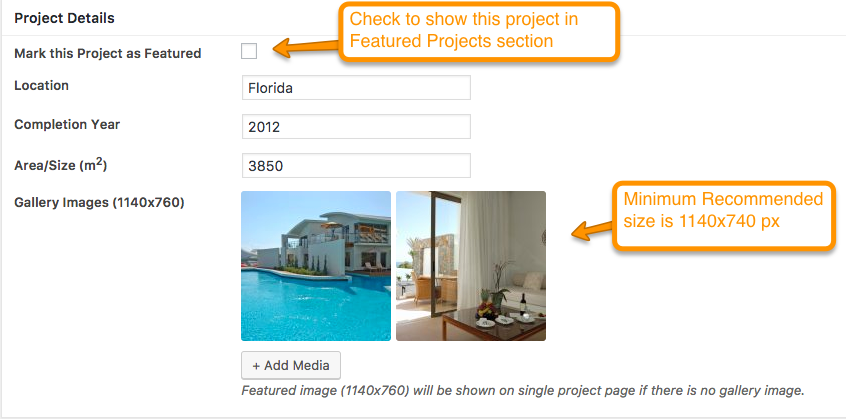
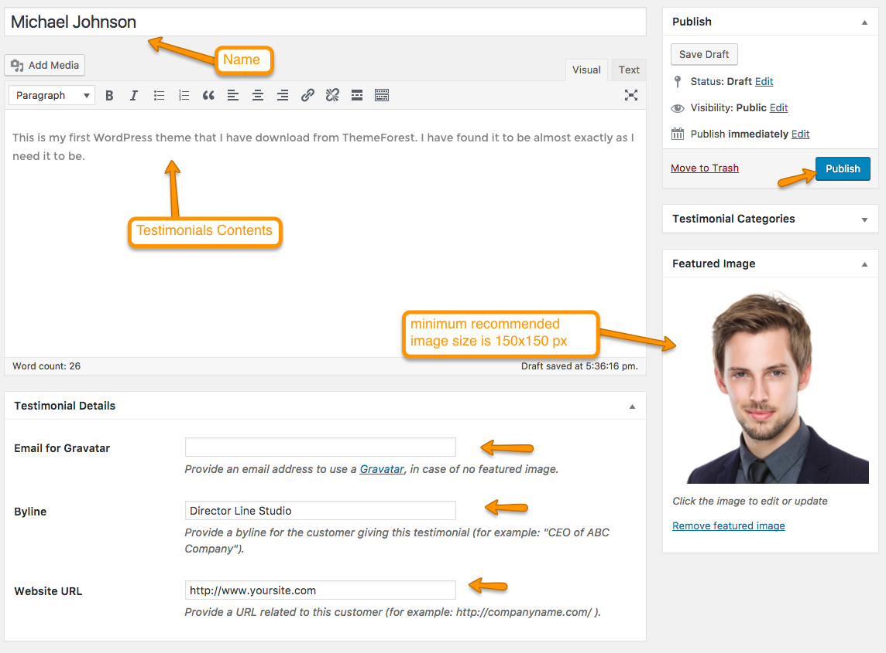

#Add Blog Posts

Go to <strong>WordPress Admin > Posts > Add New</strong>

 

Enter to Post contents and Featured image with receommended size of <strong>750x440</strong> px and click on "Publish".

 

#Add Services

Go to <strong>WordPress Admin > Services > Add New</strong>

 

 Enter Service contents and Featured image with receommended size of <strong>750x440</strong> px.

 
  
  
 in <strong>Service Details</strong> select Projects  which is related to this service. These Projects will be shown on service single page right sidebar.

 
  
  

 Click on "Add Media" button of Service Brochures to add service related brochures. These Brochures will be shown on service single page right sidebar.

 

 Select the file and edit Title as given in screenshot below.

  

  You can add as many Brochures as you want.
   
  Click on "Publish" and the service has been added.

#Add Projects

Go to <strong>WordPress Admin > Projects > Add New </strong>

Enter Project contents and Featured image with receommended size of <strong>1140x760</strong> px.

If <strong>Project Details</strong> add Project related details as shown below in image.
 
If checkbox is checked, Project will be shown in featured section.

When all details are completed click "Publish" button.

#Add Team Members
Go to <strong>WordPress Admin > Team > Add New Member</strong>

Add Team Member details and featured image with recommended size of <strong>720x540</strong> px.

Add Member's Designation and Social Links as shown in image below.

Click on "Publish" and the Team Member has been added.

#Add Testimonials

Need <strong>Quick and Easy Testimonials</strong> plugin to be installed and activated.

Go to <strong>WordPress Admin > Testimonials > Add New Member</strong>

Add Testimonials details with featured image of size <strong>150x150</strong> px. You can add your gravatar by giving email address.

# Add Products

Need <strong>WooCommerce</strong> plugin to be installed and activated.

Go to <strong>WordPress Admin > Products > Add New Product</strong>

Add Product name and contents.

Set product image and gallery images. If you want to learn about product image sizes, consult <strong>Basic Setup > Setup WooCommerce</strong> in documentation.
 
When all completed click "Publish" to add the product.

