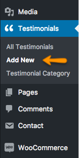

#Adding Contents

##Add Blog Posts

Go to <strong>WordPress Admin > Posts > Add New</strong>

 

Enter to Post contents and Featured image with minimum receommended size of <strong>750x440</strong> px and click on "Publish".

 
 

##Add Services

Go to <strong>WordPress Admin > Services > Add New</strong>

 

 Enter Service contents and Featured image with minimum receommended size of <strong>750x440</strong> px as shown in image below.

 
  
  
 Now go down in <strong>Service Details</strong> Meta box, select Projects which are related to this service.
 This projects checkbox list will only appear if Projects are added. You can learn how to <a href="#add-projects">Add Projects</a> in next section.

 
  
  
 These selected projects will be shown on service detail page as shown in image below.
 
  
  
 Give Brochures Headings to override default heading of "Related Projects" as shown in image below.
  
  
  

 Click on "Add Media" button of Service Brochures to add service related brochures. These Brochures will be shown on service detail page.
 

 Select the file and edit Title as given in screenshot below.
  
   

  A button for download file will appear on service detail page. You can add as many Brochures as you want.
  

   
  Click on "Publish" and the service has been added.

##Add Projects

Go to <strong>WordPress Admin > Projects > Add New </strong>

Enter Project contents and Featured image with minimum receommended size of <strong>1140x760</strong> px.

Now go down to <strong>Project Details</strong> meta box and add Project related details as shown below in image.
 
If checkbox is checked, Project will be shown in Featured Projects.

Go through <strong>Visual Composer Elements</strong> in documentation to learn about <a href="../visual-composer/#featured-projects-1">Featured Project 1</a> and <a href="../visual-composer/#featured-projects-2">Featured Project 2</a>

When all details are completed click "Publish" button to add Project.

##Add Team Members

Go to <strong>WordPress Admin > Team > Add New Member</strong>

Add Team Member details and featured image with minimum recommended size of <strong>720x540</strong> px.

Now go down and add Member's Designation and Social Links as shown in image below.

Click on "Publish" and the Team Member has been added.

##Add Testimonials

!!!warning ""
    Need <strong>Quick and Easy Testimonials</strong> plugin to be installed and activated.

Go to <strong>WordPress Admin > Testimonials > Add New Member</strong>

Add Testimonials details with featured image of size <strong>150x150</strong> px. You can add your gravatar by giving email address.

##Add Products

!!!warning ""
    Need <strong>WooCommerce</strong> plugin to be installed and activated.

Go to <strong>WordPress Admin > Products > Add New Product</strong>

Add Product contents with minimum recommended image size 600x600 px.

