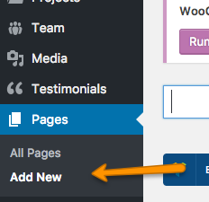
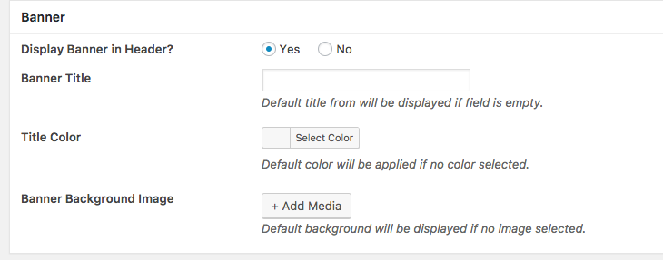
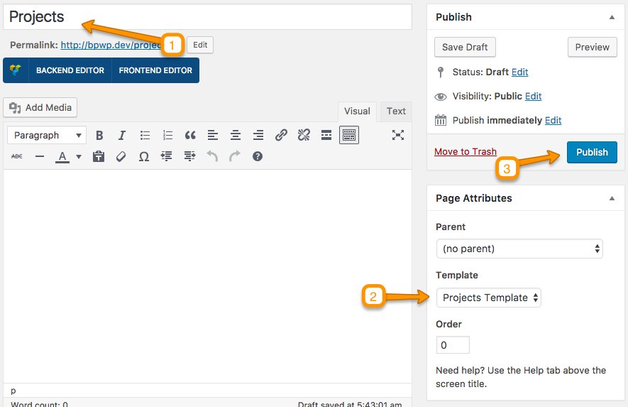
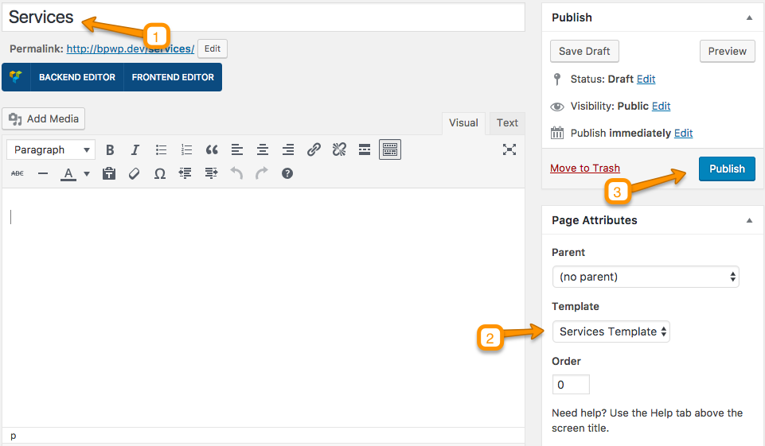
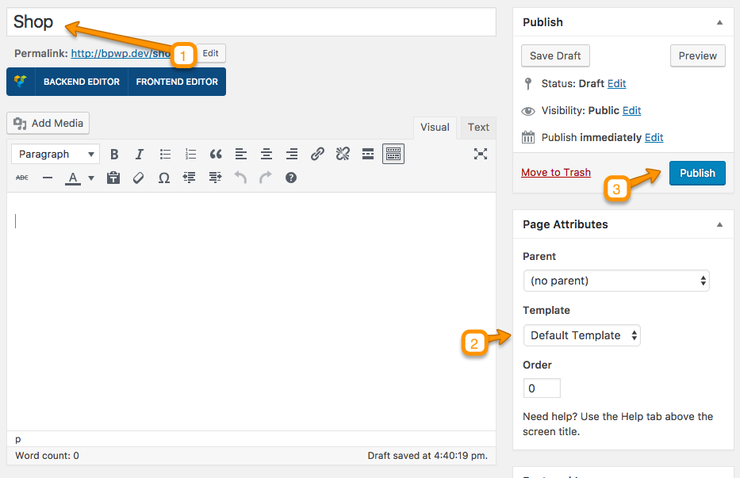
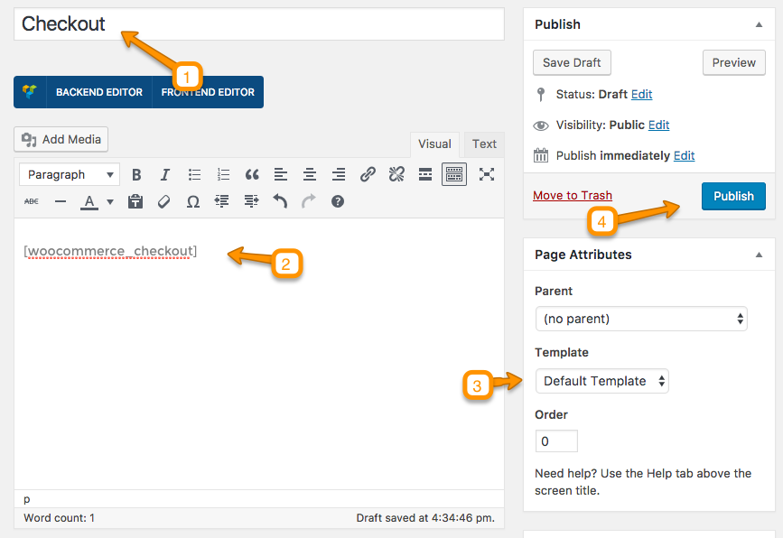

<h1>Create New Page</h1>

In case of <strong>Demo Import</strong> the initial pages are already created and you do not need to create a new page.

To create a new page go to WordPress Admin <strong>Pages > Add New</strong>.
 
 
  

You will see Metabox whenever you are going to create a page. These Metaboxes values will over ride the default settings in <strong>Customizer</strong> related to banner <strong>Title, Title Color,</strong> and <strong>Background Iamge</strong>.
You can also disbale the banner in header.

#Blog Page

You can give this page a title "Blog" yet you do not need to include any contents. Select the “Default Template” as template from the Page Attributes section, as displayed in screen shot below and click “Publish”.
 

After that consult <a href="../install/index.html#configure-reading-settings">Basic Setup > Configure Read Settings</a> in this documentation to configure it as Posts Page.

#Portfolio/Projects Page

You can give this page a title "Projects" yet you do not need to include any contents. Select the “Projects Template” as template from the Page Attributes section, as displayed in screen shot below and click “Publish”.
 

#Services Page

You can give this page a title "Services" yet you do not need to include any contents. Select the “Services Template” as template from the Page Attributes section, as displayed in screen shot below and click “Publish”.
 

#WooCommerce - Shop Page

You can give this page a title "Shop" yet you do not need to include any contents. Select the “Default Template” as template from the Page Attributes section, as displayed in screen shot below and click “Publish”.

#WooCommerce - Cart Page

You can give this page a title "Cart" and add Shortcode <strong>[woocommerce_cart]</strong> in content area. Select the “Default Template” as template from the Page Attributes section, as displayed in screen shot below and click “Publish”.

#WooCommerce - Checkout Page

You can give this page a title "Checkout" and add Shortcode <strong>[woocommerce_checkout]</strong> in content area. Select the “Default Template” as template from the Page Attributes section, as displayed in screen shot below and click “Publish”.

#WooCommerce - My Account Page

You can give this page a title "My Account" and add Shortcode <strong>[woocommerce_my_account]</strong> in content area. Select the “Default Template” as template from the Page Attributes section, as displayed in screen shot below and click “Publish”.

For complete documentation of creating WooCommerce pages you can <a target= "_blank" href="https://docs.woocommerce.com/document/woocommerce-pages/">consult here</a>.