#Theme Settings

##Header Settings
For Customize options go to <strong>Appearance > Customize</strong>
 
 
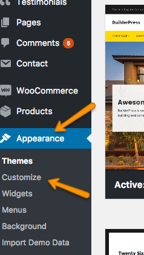
<ol>

<li>
Select header layout from <strong>Header > Header Layouts </strong>. You can also enable <strong>Sticky Menu</strong>.
 
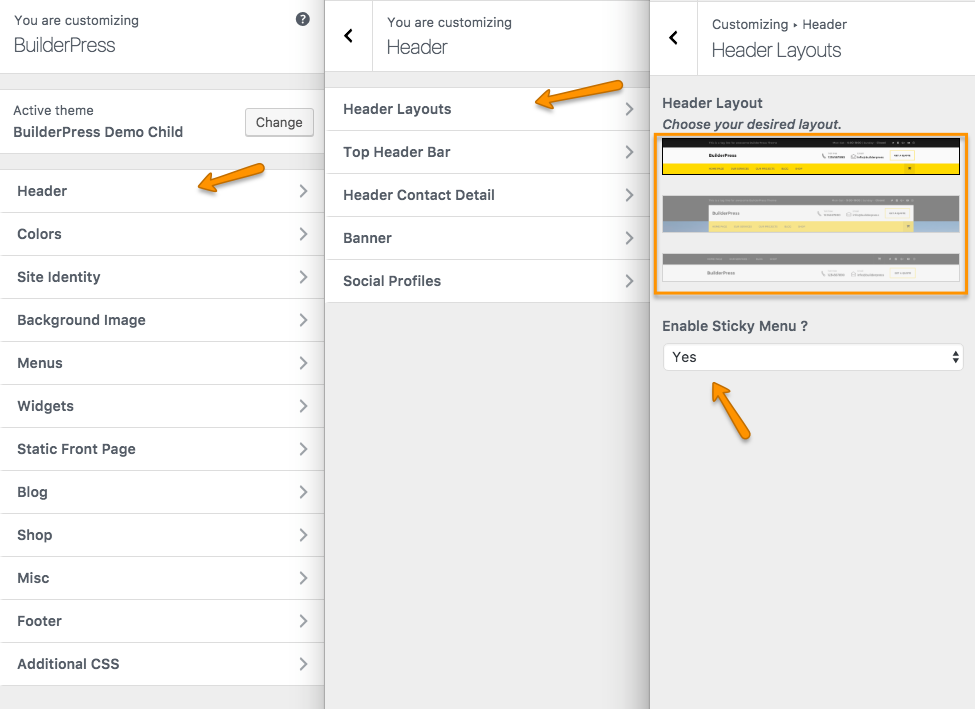
 
 
 
</li>

<li>
Fill information in Top Header Bar from <strong>Header > Top Header Bar </strong>
 

 
 
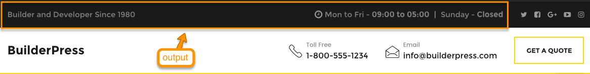
 
 
 
</li>

<li>
Enter Header Contact Detail from <strong>Header > Header Contact Detail</strong>.
 
Default icons will be displayed for Phone and Email if no icon is selected.
 
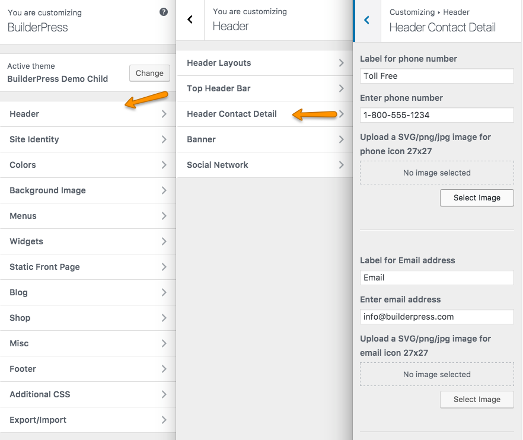
 
 
Select Button Text and Page to link.
 
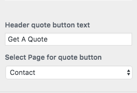
 
 
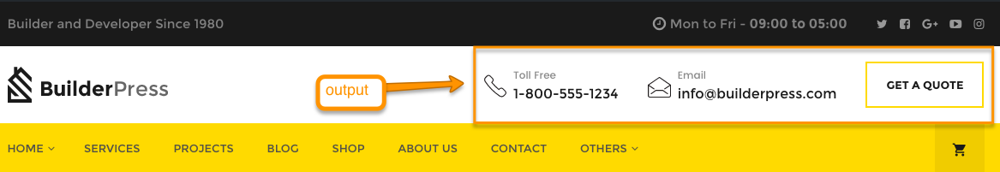
 
 
 
</li>

<li>
For Banner options go to <strong>Header > Banner</strong>. Uploaded image will be shown on banner of all inner pages except the ones who has their own customer banner provided in their meta box settings..
 

 
 
 
</li>

<li>
Enter Social Network details from <strong>Header > Social Network</strong>. You can Enable/Disbale Social Networks display in Header and Footer.
 
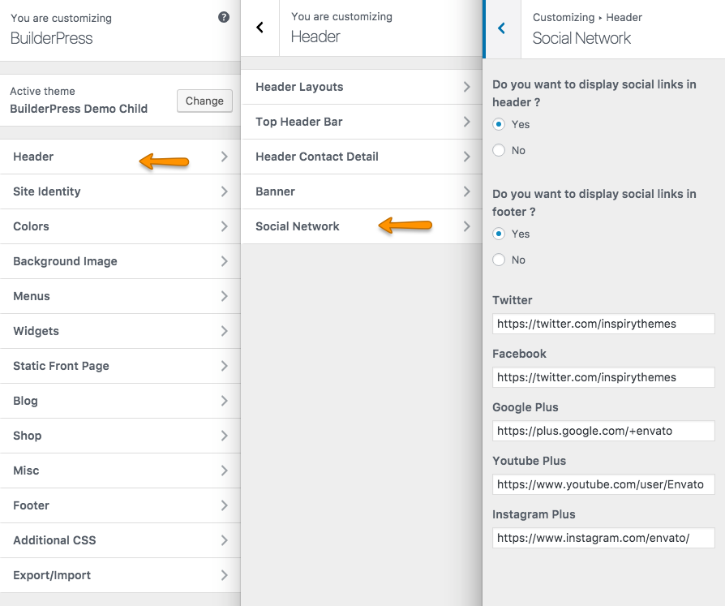
 
 
 
</li>

</ol>

##Colors
Select your desired <strong>Color Schemes</strong> from Customizer <strong>Colors</strong>. You can set your own <strong>Custom Theme Color Schemes</strong> by giving hex code as shown in image below. You can also set top menu color and hover color.
 
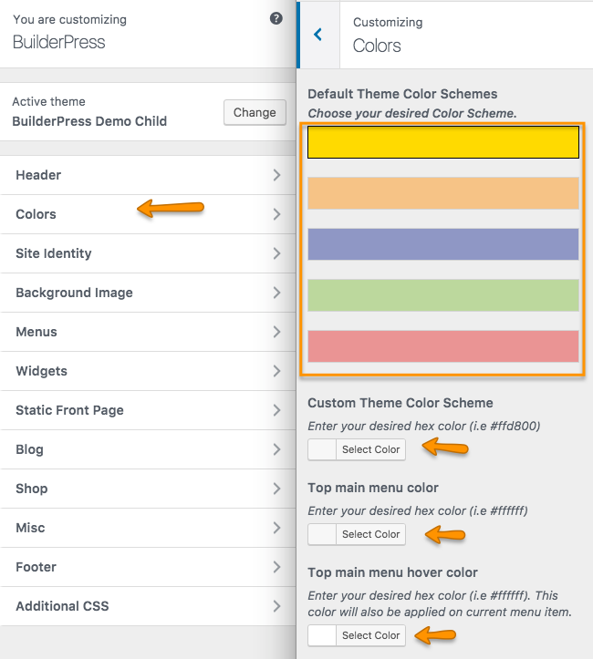

##Site Identity

Select <strong>Site Identity</strong> to enter Logo, Site Title, Tagline and Site Icon.
 
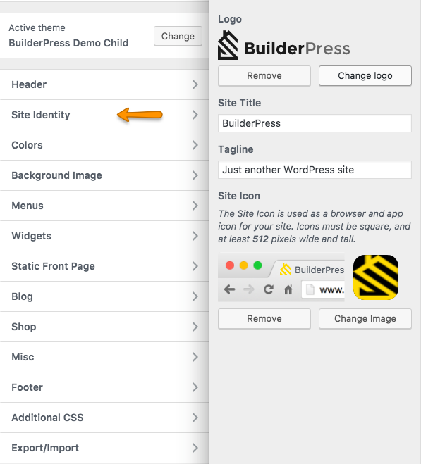
 
 
 

##Blog

Enter BLog pages banner title from <strong>Blog</strong> panel. Default page title will be shown if field is empty.
 
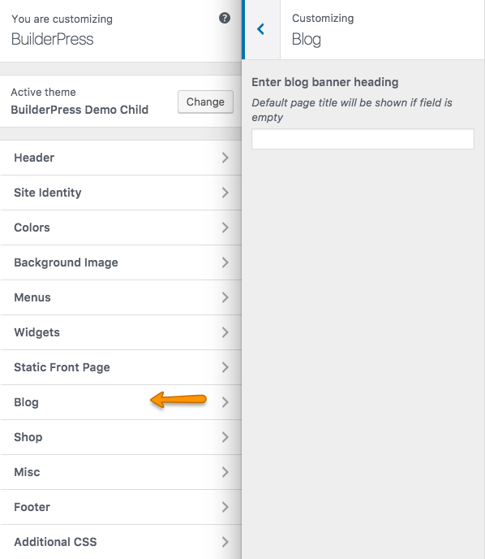
 
 
 

##Shop

Select <strong>Shop</strong> panel to enter shop pages Banner Image, Title, Title Color and Products per page.
 

 
 
 

##Google Map

Select <strong>MISC > Google Map</strong> to enter map coordinates and Google Map API key. 
If you wnat to learn how to get coordinates <a href="#google-map-coordinates">Click Here</a>. 
if you want to learn how to get Google Map API Key <a href="#google-map-api-key">Click Here</a>.
 
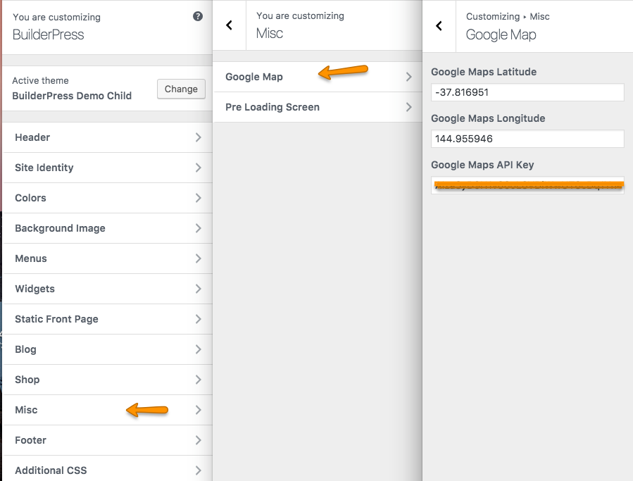
 
 
 

 <h4 id="google-map-coordinates">How To Get Google Map Coordinates</h4>
 Follow the steps to get Google Map coordinates.
  
  
  <ol>
  <li>
    Open <a target="_blank" href="https://www.google.com/maps">Google Map</a> and go to your desired location.
     

  </li>
  <li>
   Right click on your map location and click on <strong>What,s here?</strong>.
   
  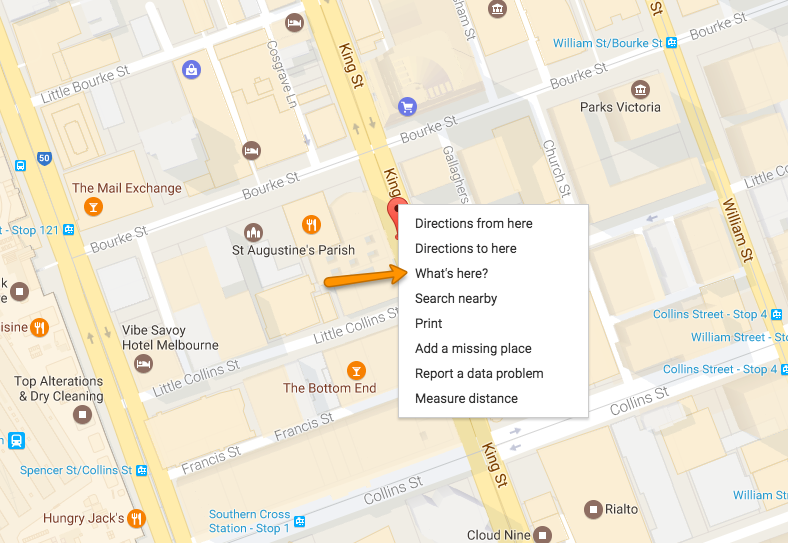
  </li>

  <li>
  You will see a box appearing at the bottom of the map with coordinates. Click on these coordinates.
   
   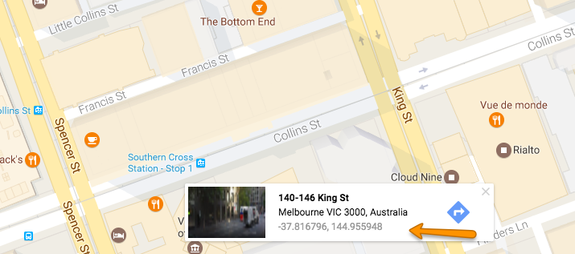

  </li>

  <li>
  After clicking you can see coordinates on left reveal bar of Google Map.
   
    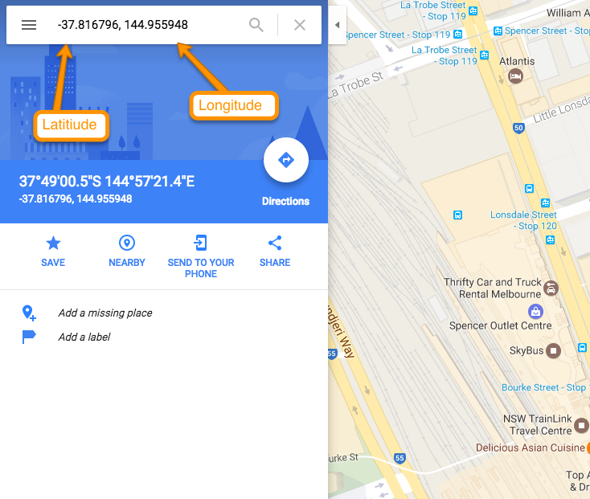

  </li>
  <li>
  Copy These coordinates and paste in Customize Settings <strong> MISC > Google Map </strong>.
   
        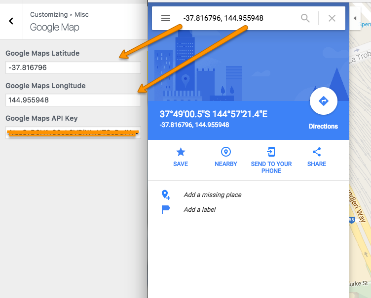
 
 
 
  </li>

  </ol>

   <h4 id="google-map-api-key">How To Get Google Map API Key</h4>

   Follow the steps to get Google Map API key

   <ol>
   <li>
    To generate Google Map API key go to this <a target="_blank" href="https://developers.google.com/maps/documentation/javascript/get-api-key">Link</a>.
     
     
   </li>
   <li>
   Click on <strong>GET A KEY</strong>.
    
       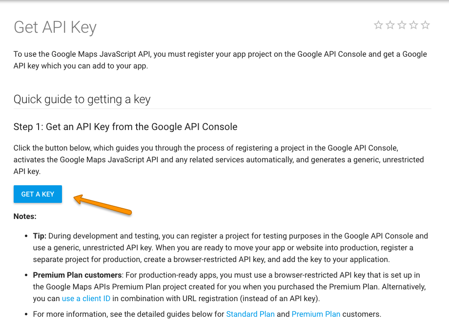

   </li>

  <li>
   Create New or select your project and click on <strong>ENABLE API</strong>.
    
  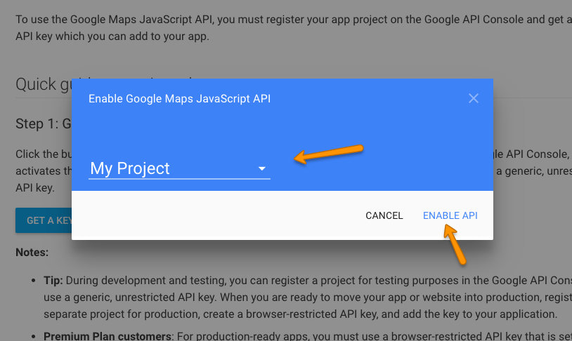

   </li>

  <li>
   Your Google Map API is genereated.
    
  

   </li>

  <li>
   Copy the generated API key and paste in Customize Settings <strong> MISC > Google Map </strong>.
    
  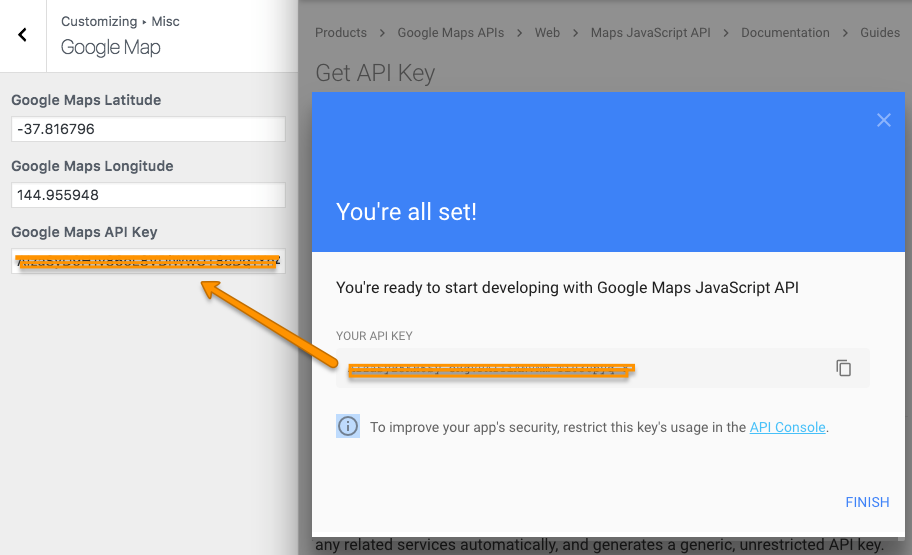
 
 
 
   </li>

   </ol>

##Pre Loading Screen

  You can enable/disable Page Pre Loader from <strong> MISC > Pre Loading Screen </strong>.
    
 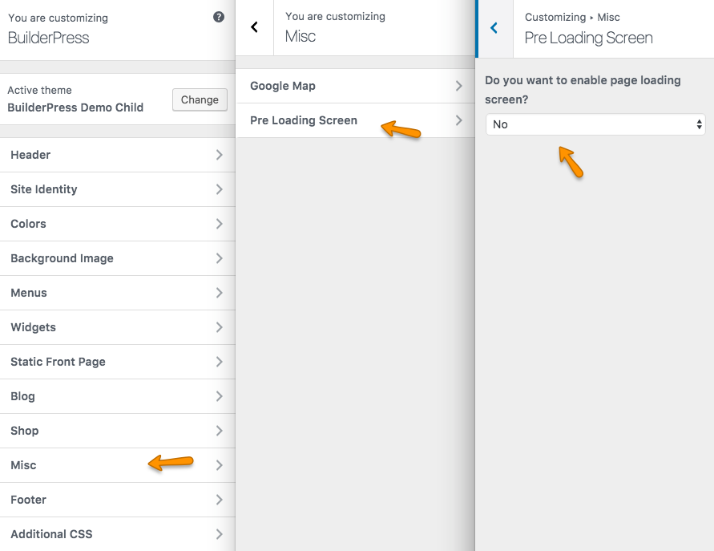

##Footer

<ol>
<li>
  Go to <strong>Footer > CTA Bar</strong> and setup Call To Action Bar in footer.
  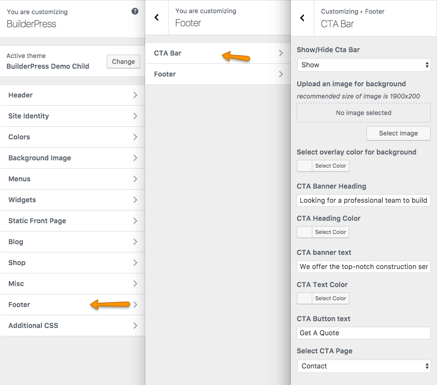
   
   
   
</li>
<li>
  Go to <strong>Footer > Footer</strong> and enter contents in footer.
  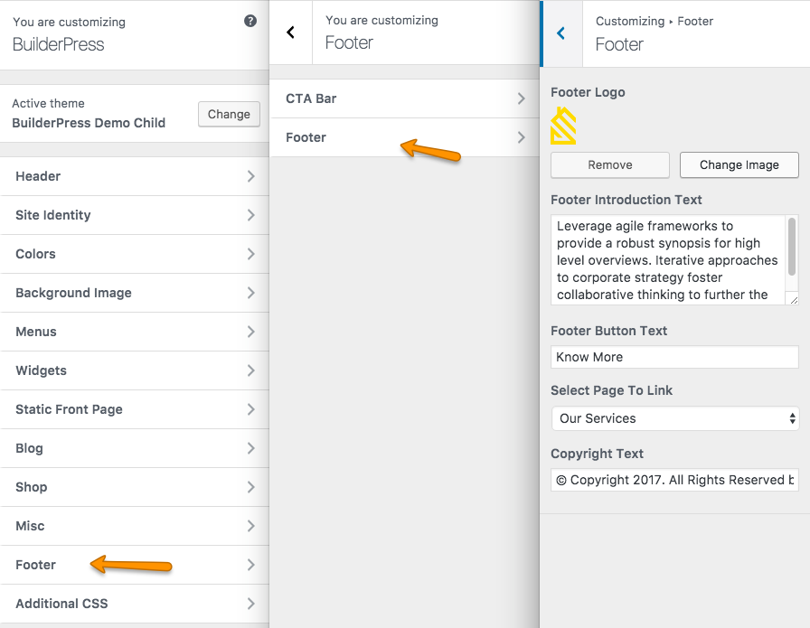
     
     
     
</li>

</ol>

##Additional CSS
 Go to <strong>Additional CSS</strong> to enter custom styles.
  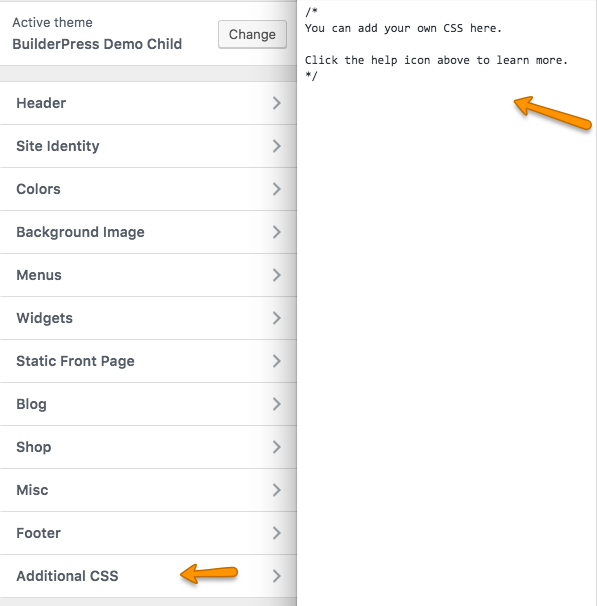
