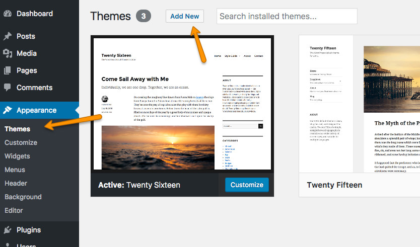
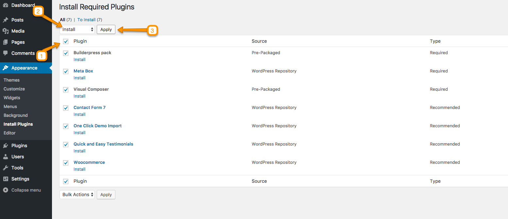
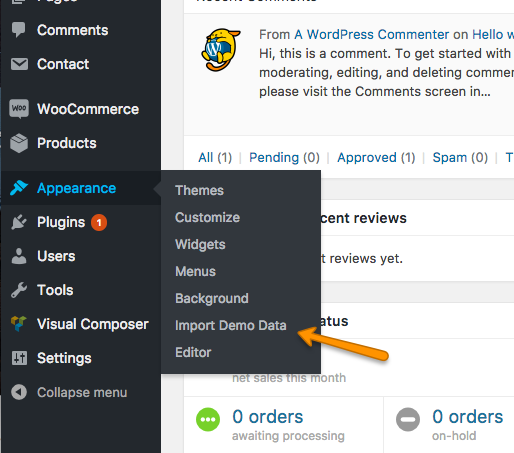
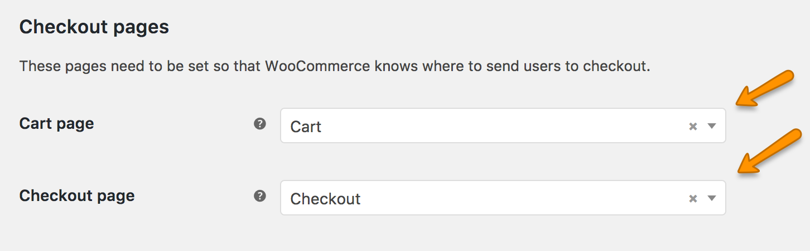
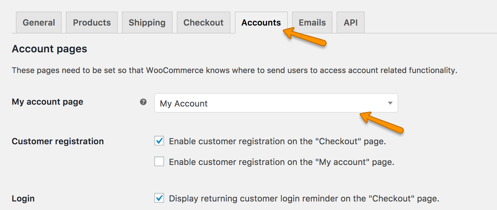
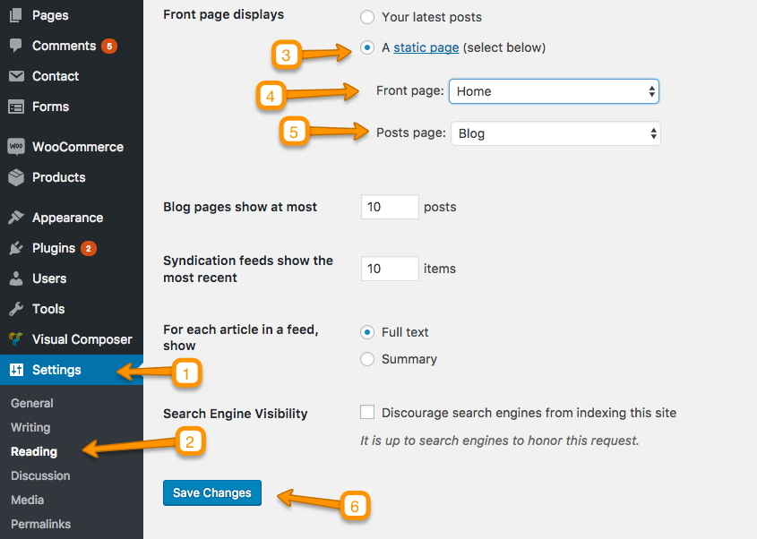
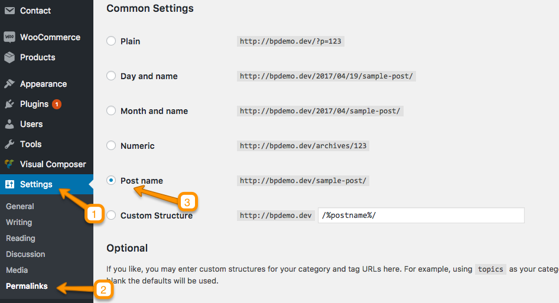
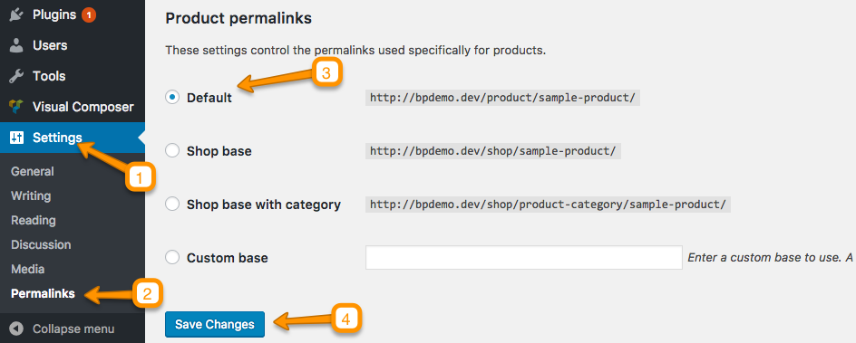

# Install Theme

To start you must have a working version of WordPress. Almost all major web hosts provides one click WordPress install and you can consult your host's help site for more information in this regard. For manual install you can consult WordPress Codex <a target="_blank" href="https://codex.wordpress.org/Installing_WordPress" target="_blank">Installing WordPress</a>.

Once you have a working version of WordPress, You need to download "<a target="_blank" href="../img/all-files.png">All Files and Documentation</a>" from themeforest <a target="_blank" href="https://themeforest.net/downloads" traget="_blank">download page</a> and extract the downloaded zip to get various files including <strong>inspiry-builderpress.zip</strong>.

<h2>Install Theme Via WordPress Dashboard</h2>

<ol>
<li>Go to 'Appearance > Themes' section.    </li>
<li>Click 'Add New'.         </li>
<li>Select the 'Upload Theme' option.     </li>
<li>Choose the <strong>inspiry-builderpress.zip</strong> file and press 'Install Now'.   </li>
<li>Once the theme is uploaded you need to activate it.    </li>
<li>After activation go to "Appearance > Customize" to play with theme's settings. You can learn about <a href="../customizer/index.html#header-settings">Customize settings in documentation</a>.
    </li>
</ol>

if you face any problem during upload through dashboard, please upload the theme using FTP as guided below.

<h2>Install Theme Via FTP ( Alternative Way )</h2>

if you face any problem during upload through dashboard, please upload the theme using FTP as guided below.

<ol>
<li>Access your hosting server using an ftp client like <a href="https://filezilla-project.org/" target="_blank">FileZilla</a></li>
<li>Go to the 'wp-content/themes' folder of your WordPress installation</li>
<li>Extract the <strong>inspiry-builderpress.zip</strong> file and put the inspiry-builderpress folder in 'wp-content/themes/' folder</li>
<li>Go to 'WordPress Dashboard > Appearance > Themes' section to activate the theme</li>
</ol>

<h2>Install Child Theme</h2>

It is better to use child theme as if you need to modify anything you modify in child theme only. This way you can easily update your parent theme whenever new update becomes available on themeforest. You can read more about child theme from <a href="https://codex.wordpress.org/Child_Themes" target="_blank">Here</a>.

To install child theme, you need to upload the <strong>inspiry-builderpress-child.zip</strong> and activate it in the same way as you uploaded and activated the parent theme's <strong>inspiry-builderpress.zip</strong>.

# Install Plugins

After you have installed and activated the theme, there'll be a list of <strong>required</strong> and <strong>recommended</strong> plugins at the top of the WordPress dashboard.
  
<ol>
<li>
Click on <strong>Begin Installing Plugins</strong>

 
 
</li>
<li>
Install <strong>required</strong> and <strong>recommended</strong> plugins

 
 

</li>

<li>
Click <strong>Return to Required Plugins Installer</strong> when plugins installation is completed.

 
 

</li>

<li>
Activate the Installed Plugins.

 
 

</li>

</ol>

# Import Demo Contents

Top Import Demo Contents follow these steps.

<ol>
<li>
Go to <strong>Appearance</strong> > <strong>Import Demo Data</strong>.

 
 
</li>

<li>
Click on <strong>Import Demo Data</strong> button.

 
 
</li>

<li>Wait for importing. It may take couple of minutes to complete.
 
 
</li>
<li>
You can deactivate and delete <strong>One Click Demo Import</strong> plugin when import demo data is completed.

 
 

</li>
</ol>

# Setup WooCommerce

For basic setup of WooCommerce, go to <strong>WooCommerce</strong> > <strong>Settings</strong>.

<ol>

<li>
    If Setup Wizard appears, click on "<strong>Skip Setup</strong>".
    
     
     
</li>

<li>
    In <strong>General</strong> tab. Select options with respect to your location and currency.
    
     
     
</li>

<li>
    In <strong>Products</strong> tab, go to <strong>display</strong> option and select shop page.
    
      
    
<strong>Shop</strong> page is available due to the imported demo contents. If you do not have this page then you need to create new <strong>Shop</strong> page using "Default Template". For more assistance see <strong>Create Pages</strong> Section.

         
         
</li>

<li>
In <strong>Products</strong> tab, go to <strong>display</strong> option and set dimensions of images in your catalog.
    
         
         
</li>

<li>
In <strong>Checkout</strong> tab, go to <strong>Checkout options</strong> and select Cart page and Checkout page.
    
         
         
               
<strong>Cart</strong> and <strong>Checkout</strong> pages are available due to the imported demo contents. If you do not have these pages then you need to create new <strong>Cart</strong> and <strong>Checkout</strong>  pages using "Default Template". For more assistance see <strong>Create Pages</strong> Section.

            
         
</li>

<li>
    In <strong>Accounts</strong> tab, select My Account Page.
    
          
             
                   
<strong>My Account</strong> page is available due to the imported demo contents. If you do not have this page then you need to create new <strong>My Account</strong> page using "Default Template". For more assistance see <strong>Create Pages</strong> Section.

                
             
</li>

</ol>

# Configure Reading Settings

It is assumed that <strong>Import Demo Data</strong> is completed and you have <strong>Home</strong> page and <strong>Blog</strong> page available for use. If this is not the case then simply create a new pages with names <strong>Home</strong> and <strong>Blog</strong> using ""default template".

To configure reading settings you need to visit WordPress <strong>Admin</strong> > <strong>Settings</strong> > <strong>Reading</strong> and choose that front page displays as static page. Then select <strong>Home</strong> as Front Page and <strong>Blog</strong> as Posts Page and save the settings. As, displayed in screen shot below.

    
         

# Configure Permalinks Settings

To configure permalinks settings visit WordPress <strong>Admin > Settings > Permalinks</strong> and configure it as displayed in images below.

 
 
Choose the settings for Products if WooCommerce is installed

