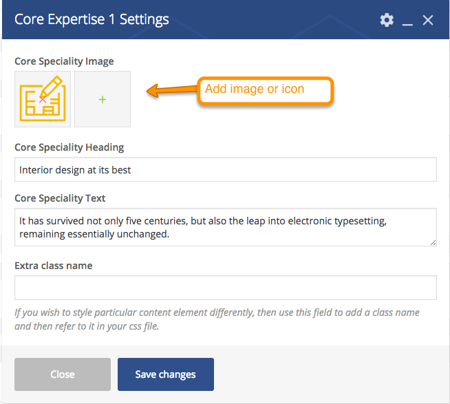
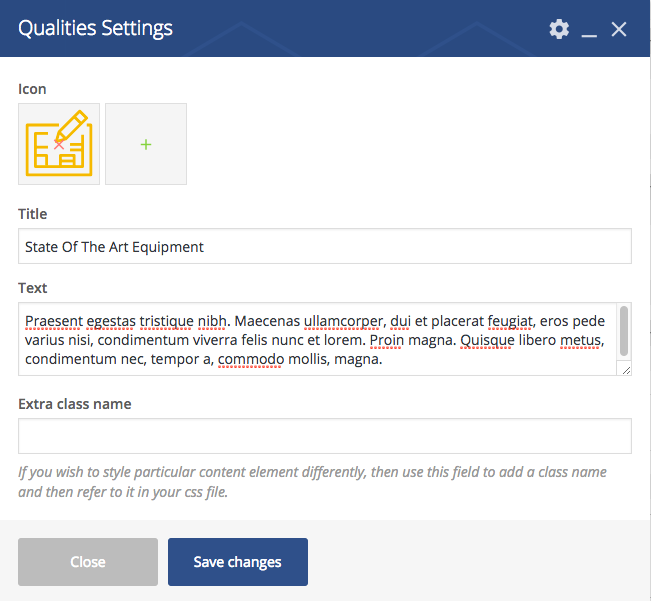
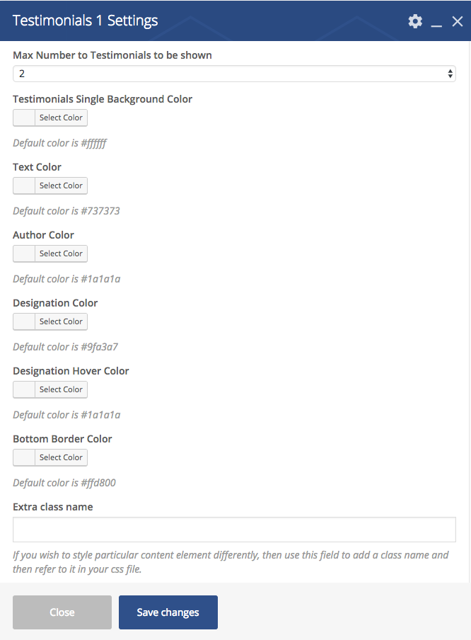

#Basic Information

BuilderPress Theme's basic pages like Home, About and Contact pages are built in <strong>Visual Composer</strong> page builder.
If you have done <strong>Demo Import</strong> then these pages have already been created along with all contents.
 
We will try to provide complete documentation of how to add Visual Composer elements in your page and how to edit them.

Visual Composer Comes with to types of Editors.

<ol>
<li>Front-end Editor</li>
<li>Back-end Editor</li>
</ol>

We recommended you to use <strong>Back-end Editor</strong> for adding content elements.

Go to <strong> WordPress Admin > Pages > Add New </strong> to create a page using <strong>Default Template</strong>.
Give it a name (i.e Home) and click on <strong>BACKEND EDITOR</strong> as shown in image below.

You can disble the banner if you are going to add Home Main Slider.

Click on "Add Element". Update the page whenever you add element and save the changes.

Go to "BuilderPress" tab to add elements. There are two types of Elements, <strong>Simple</strong> and <strong>Nested</strong>. Nested Element will add more element once they are added. Continue the documentation to learn about it.

Although all elements are self explanatory and brief desciption is geiven under every field. But we will go through all BuilderPress Visual Compser Elements.

#Section Top Icon

Add Section Top Icon from BuilderPress Elements. You can change the default settings for your requirements. Hook Icon will be displayed if no image is selected.

#section Heading and Intro

#Core Expertise 1
To Add Core Expertie Variation 1, Select default <strong>Row</strong> element of visual composer as shown in image below.

Now select the columns in that Row element as shown below.

Click <strong>+</strong> icon to add element.

Add Core Expertise 1 from BuilderPress elements. You can add Icon or Image to show. Click "Save changes" when all done.

Add Core Expertise 1 element in all columns and its done.

 
 

#Core Expertise 2
Add Core Expertie Variation 2 from BuilderPress elements. It is a nested element. you have to add its child element after adding this.

Give the heading and text to parent element as shown in image below.

When you click on "Select URL" button, another box "Inset/edit link" will open to set URL and Button text as shown belown in image. 

Now Parent element is added. Click on <strong>"+"</strong> icon to add child element.

After clicking its child element <strong>Core Expertise2</strong> will appear. Click on it to add.

Now add settings and click save.

#Call To Action Bar

Add Call To Action Bar from BuilderPress elements. You can set Button and URL as shown in <strong>Core Expertise 2</strong>.

#Google Map
Add Google Map from BuilderPress elements. Make sure that Google Map API key in <strong>Customizer > MISC > Google Map</strong> is already given.

if you want to learn how to get Google Map API Key <a href="../customizer/index.html#google-map-api-key">Click Here</a>. 
If you wnat to learn how to get Google Map Coordinates <a href="../customizer/index.html#google-map-coordinates">Click Here</a>. 

If <strong>Latitude</strong> and <strong>Longitude</strong> Fields are empty, <strong>Customizer > Misc > Google Map</strong> default Coordinates will be appled.

#Contact Form

Add Contact Form from BuilderPress elements. Both <strong>Contact Form 7</strong> and <strong>Ninja Forms</strong> are supported.

#Why Choose Us

Add Why Choose Us element from BuilderPress elements and save it.

Click <strong>+</strong> icon to add children.

Click one of its children to add i.e Qualities.

Enter Icon, Title and Text for the Qualities.

Again to add more children i.e Images, click on inner <strong>+</strong> icon.

Add image and set positions within it contanier. If all positions set to 0, the image will be in center.

When all qualities are set like shown below in image. click "Update".

You will see beautiful section like the demo contents as shown in image below.

#Client and Partners

Add Client and Partners element from BuilderPress elements. You have option to show them in carousel. 

Click <strong>+</strong> icon to add clients and partners. 

Add Client and Partner item. 

Add settings for the client and partner and save changes. 

#Team Members

Add Team Members element from BuilderPress elements. Make sure Team Members are added in <strong>WordPress Admin > Team </strong>.
 

#Testimonials 1

Add Testimonials 1 element from BuilderPress elements. Make sure Testimonials are added in <strong>WordPress Admin > Testimonials </strong>.
 

#Testimonials 2

Add Testimonials 2 element from BuilderPress elements. Make sure Testimonials are added in <strong>WordPress Admin > Testimonials </strong>.
 

#Recent Posts

Add Recent Posts element from BuilderPress elements. Blog posts will shown in this section.
 

#Recent Projects

Add Recent Projects element from BuilderPress elements and save changes. All projects will be displayed in this section if they have been assigned catagories.
 

#Featured Projects 1

Projects that are marked as featured in single projects metabox will be displayed as shown in image below.
 

Add Featured Projects 1 element from BuilderPress elements and click "Save Changes". 

#Featured Projects 2

Projects that are marked as featured in single projects metabox will be displayed as shown in image below.
 

Add Featured Projects 2 element from BuilderPress elements and click "Save Changes". 

#Services 1
Add Services 1 element from BuilderPress elements. Make sure services are added in <strong>WordPress Admin > Services</strong>.

When you click on "Select URL" button, another box "Inset/edit link" will open to set URL and Button text as shown belown in image. 

#Services 2
Add Services 2 element from BuilderPress elements. Make sure services are added in <strong>WordPress Admin > Services</strong>.

When you click on "Select URL" button, another box "Inset/edit link" will open to set URL and Button text as shown belown in image. 

#Contact Details

Add Contact Details from BuilderPress elements and click "Save Changes".  

Click <strong>+</strong> icon to add Contact Details. 

Add child elements.

Lets add first <strong>Contact Detail List</strong> as shown in image below.

Click on inner <strong>+</strong> icon to add more items. you can add more contact detail elements like email, fax, address etc.

Now add Office Opening Days/Hours element.

#Home Main Slider

Add Home Main Slider from BuilderPress elements.

Click <strong>+</strong> icon to add Slides. 

Click Home Mail Slide Single to add as slide.

Setup slide's detail as shown in image below. You can add as many slides as you want.

When you click on "Select URL" button, another box "Inset/edit link" will open to set URL and Button text as shown belown in image. 

#Core Values Carousel

Add Core Values Carouel and select settings as shown in image below. 

Click <strong>+</strong> icon to add Slides. 

Add Core Values Item  

Setup Core Values Item settings as shown in image below. you can add as many slides as you want. 

